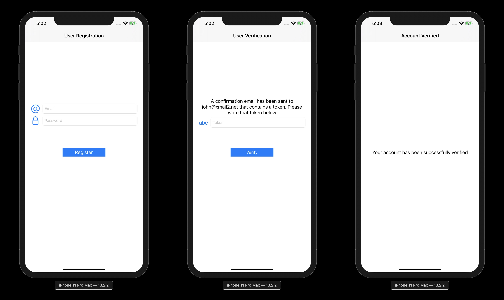

# Introduction
The challenge is to create a simple iOS app that demonstrates two steps in user email verification process.
1. Register a new user with an email and password
2. When user is registered verify the email through a verification token.
Once user is verified show a success message
# Important Links
The iOS app is developed to demonstrate the above mentioned steps. 

Screen recording showing the app working can be found [here](https://drive.google.com/file/d/1yXC8dTo2r5cpqE7-v9YIphyjamnaRaNb/view?usp=sharing)

Below are three screenshots showing three screens of app

# System Requirements:
- macOS 10.15.1 
- Xcode 11.2.1

# How To Run:
Clone the app repo
- `git clone https://github.com/khurram18/EMailVerifier.git`
- Navigate to  the cloned directory and open EMailVerifier.xcworkspace by double clicking on it and opening it in Xcode.
- Press `Command + R` to run the app in iOS Simulator.
# Dependency Management
Cocoapods is used for managing third party dependencies. Cocoapods is the most common and oldest dependency management tool used by iOS development community.
# Third Party Libraries
Below is the list showing the third party libraries used and the reason for their usage.
1. *Apollo*: This is used for generating custom GraphQL client for Run The World backend.
2. *RxSwift*: This is used for adding reactive functionality to swift programming language.
3. *RxCocoa*: This is used for adding reactive functionality to UIKit classes. RxCocoa itself is built on top on RxSwift.
4. *Hero*: This is used for adding custom animations.
